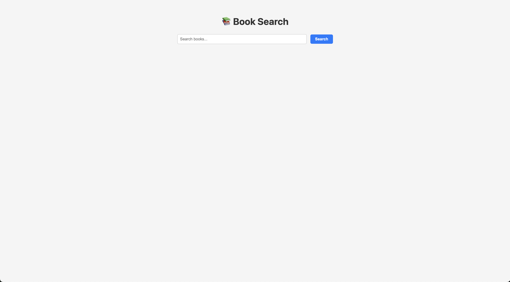

# Node js monolith application
Base Node.js monolith application built with Express.js, created primarily for the ECS video series to demonstrate various Amazon ECS features. Each branch corresponds to a specific ECS feature covered in the series, allowing step-by-step exploration alongside the videos.

## User Interface
#### Home

#### Search


## Prerequisites 
1. Install [HomeBrew](https://brew.sh/)
```bash
/bin/bash -c "$(curl -fsSL https://raw.githubusercontent.com/Homebrew/install/HEAD/install.sh)"
```

2. Install [Colima](https://formulae.brew.sh/formula/colima)
```bash
brew install colima
```

3. Install [Docker](https://formulae.brew.sh/formula/docker)
```bash
brew install docker
```

4. Install [Docker Compose](https://formulae.brew.sh/formula/docker-compose)
```bash
brew install docker-compose
```

5. Starts Colima using Docker as the runtime
```bash
colima start --runtime docker
```

6. Install [AWS CLI V2](https://docs.aws.amazon.com/cli/latest/userguide/getting-started-install.html#getting-started-install-instructions)
```bash
curl "https://awscli.amazonaws.com/AWSCLIV2.pkg" -o "AWSCLIV2.pkg"
```
```bash
sudo installer -pkg ./AWSCLIV2.pkg -target /
```
```bash
which aws
```
```bash
aws --version
```

## Local Docker Workflow
1. Build docker image
```bash
docker build -t node-monolith-app .
```
2. Run Docker image
```bash
docker run -p 3200:3200 node-monolith-app
```

## Configure AWS CLI for IAM user
1. Set your configuration settings
```bash
aws configure
```
2. To check if the CLI configuration was successful
```bash
aws ecr describe-repositories
```

## Create a repository
```bash
aws ecr create-repository \
    --repository-name <repository-name> \
    --region <region>
```

## Authenticate to your default registry
```bash
aws ecr get-login-password --region <region> | docker login --username AWS --password-stdin <aws_account_id>.dkr.ecr.<region>.amazonaws.com
```

## Tag the image
```bash
docker tag <image-name>:latest <aws_account_id>.dkr.ecr.<region>.amazonaws.com/<repository-name>
```

## Push the image
```bash
docker push <aws_account_id>.dkr.ecr.<region>.amazonaws.com/<repository-name>:latest
```

## Pull an image from Amazon ECR
```bash
docker pull <aws_account_id>.dkr.ecr.<region>.amazonaws.com/<repository-name>:latest
```

## List images
```bash
aws ecr list-images --repository-name <repository-name> --region <region>
```

## Delete an image
```bash
aws ecr batch-delete-image \
      --repository-name <repository-name> \
      --image-ids imageTag=latest \
      --region <region>
```

## List repositories
```bash
aws ecr describe-repositories 
```

## Delete a repository
```bash
aws ecr delete-repository \
      --repository-name <repository-name> \
      --force \
      --region <region>
```

## Building and Pushing a Multi-Platform Docker Image to Amazon ECR
1. Create and Set Buildx Builder
```bash
docker buildx create --use
```

2. Initialize Buildx Builder
```bash
docker buildx inspect --bootstrap
```

3. Build Docker Image for ECS
```bash
docker buildx build \
  --platform linux/amd64 \
  -t <aws_account_id>.dkr.ecr.<region>.amazonaws.com/<repository-name>:latest \
  --load .
```

4. Push Docker Image to Amazon ECR
```bash
docker push <aws_account_id>.dkr.ecr.<region>.amazonaws.com/<repository-name>:latest
```

## High CPU Load Simulation
```bash
for i in {1..50}; do
  (time curl "http://<ALB-DNS>/cpu-load" > /dev/null) 2>&1 | grep real &
done
wait
```